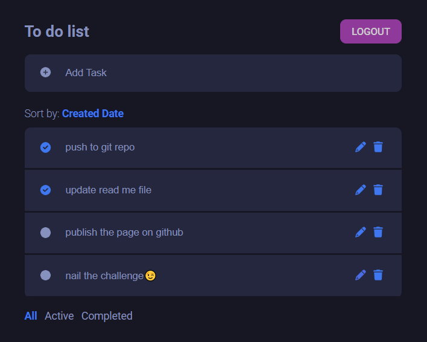

# To Do List

### Pages

- login page
- register page
- to do list page

### Features

- Authentication is required
- [api integration](https://documenter.getpostman.com/view/8858534/SW7dX7JG#83f03f13-598d-4790-80be-f40050d3f0f1)
- login and register fields are validated

  > check the below screenshots:
  >   
  >   
  >   
  > 

- To do list

  > 1- Adds, edits and deletes tasks
  >
  > 2- Filter by all, completed and active tasks
  >
  > 3- Sort tasks by creation date, A to Z and Z to A
  >
  > 4- Mark tasks as complete or incomplete
  >
  > check the below screenshots:

  

## Styling notes

- Look is inspired by black themes in general
- Icons were taken from font awesome
- styles were added without the use of UI framework such as bootstrap
- transitions were applied as an example
- @todo change alerts to Notification components

## React commands

- This project was bootstrapped with [Create React App](https://github.com/facebook/create-react-app).

- In the project directory, you can run:

### `npm start`

Runs the app in the development mode.
Open [http://localhost:3000](http://localhost:3000) to view it in your browser.
The page will reload when you make changes.
You may also see any lint errors in the console.

### `npm run build`

Builds the app for production to the `build` folder.

It correctly bundles React in production mode and optimizes the build for the best performance.

The build is minified and the filenames include the hashes.
Your app is ready to be deployed!

See the section about [deployment](https://facebook.github.io/create-react-app/docs/deployment) for more information.
